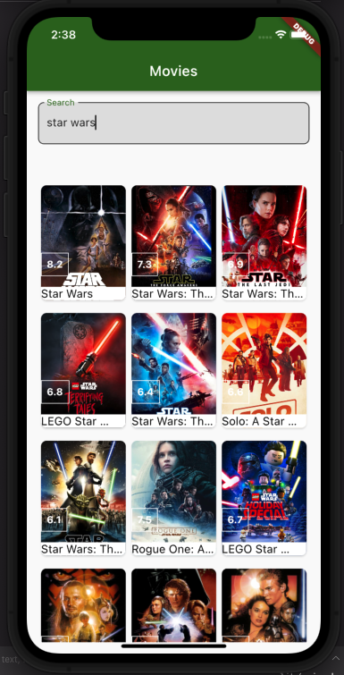
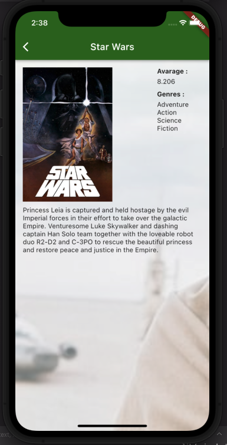

# Movie Project

A Flutter project using The Movie Database API 

## Features
 * Clean Architecture
 * Pagination
 * BLoC (for state management)
 * JsonSerializable (for model serialization)
 * get_it (for dependecy injection)
 * injectable (for generating get_it configuration file)
 * dio (for network requests)
 * mocktail (for tests)
 * unit tests

## Screenshots

<table>
    <tr>
        <td></td>
        <td></td>
    </tr>
</table>

## 🤓 Author
**Buğra Göksu** 
